# Learn-the-basics-of-Spark-AR-by-creating-your-FanMask-filter

> Now is the time to learn how to easily create your first augmented reality filter and share it on Instagram with Spark AR the best software for beginners to create awesome filters.

While Instagramming, there's a good chance you've come into contact with an AR filter in some way and have probably had the urge to create your own Instagram filter. So we made this tutorial to teach you how to make Instagram filters. Know that it is very **easy** to create simple filters, to make them accessible to everyone on Instagram and **Anyone can do it** thanks to the software **Spark AR Studio**, which only works on computer.

Through this tutorial, we'll show you how to easily create your first Spark AR augmented reality filter and share it on the Facebook family of apps like Instagram Using:
- Spark AR Studio
- A smartphone
## Purpose
The purpose of this tutorial is to provide a general overview of Spark AR Studio and its working interface, create a sports fan face mask AR filter, test it and export it to Instagram.
## Prerequisites
- Have access to a machine connected to the internet
- Have access to a smartphone connected to the internet
- Have downloaded and installed **Spark AR studio** on your machine (If you haven't done it yet or don't know how to do it, that's okay because we'll explain how to do it in this tutorial) .
- Have installed the application for iOS and Android **Spark AR Player** on your smartphone.
- Have an Instagram and / or Facebook account in good standing.
## Summary
- Introduction and Getting Started with Spark AR Studio
- Creation of a filter for sports fan (FanMask)
- Publish your fanMask filter on Instagram

## Introduction and Getting Started with Spark AR Studio
**Augmented Reality (AR)** is a technology that allows the superimposition of virtual elements (sounds, 2D, 3D images, videos, etc.) within a real-time environment. The principle is to combine the virtual and the real and give the illusion of perfect integration to the user.

**AR filters** are computer-generated effects designed to be overlaid on real images. AR filters work with your camera, adding a layer or images to the foreground or background of your image. While Instagram AR Filters were first introduced in 2017, it was not possible for anyone to create their own AR filters until recently when Facebook released their AR filter maker app called Spark AR Studio.

**Spark AR Studio** is free software developed by Facebook to help anyone have an augmented reality experience by making AR filters for **Instagram** and **Facebook**. The software is available for Windows and Mac. In order to test your AR filters, we recommend that you also download **Spark AR Player**.

**Spark AR Player** is an app for iOS and Android, which lets you see what your AR filters will look like live on a smartphone before posting it publicly on **Instagram** or **Facebook**.

#### Creating your very first Instagram AR filter will mean learning new terminology, here is a step by step guide for you to get started and terminologies used on Spark AR Studio so you can start creating your own filter.

1. **Download the Spark AR Studio software** by going to the official website at the following address: https://sparkar.facebook.com/ar-studio/download/. Click on "**download**" at the top right of the page that will appear on your screen

,

Then click again on the red button " **download** " on the left of your screen.

> You can also go to google, search for " **Spark AR studio** " and choose the first result to go to the download site.

2. **Install Spark AR Player** which is available on the Google Play Store for Android devices and on the Apple App Store for iPhones. You will also find this app in the middle of the page https://sparkar.facebook.com/ar-studio/download/. From your smartphone, you will have to click on one of the two download buttons (one for iOS and another for Android) located under " **Get the Spark AR Player** ", because from your computer, nothing will happen.

3. **Install the Spark AR.** If you don't know how, follow these instructions, it's a snap (we are using  the version 99 for Windows in this tutorial) .

- Double click on the downloaded file icon. On the interface presented to you, click on the button " **Run** "

- Then click on the button " **Next** "

- Accept the terms in the license agreement and click on " **Next** "

- In the new window, click again on " **Next** "

 

- Choose the local disk on which you want to install Spark AR, we advise you to leave the default values and simply click on " **Next** "

- Once you get to the penultimate page, all you have to do is click on " **Install** "

![alt text] (images/9.PNG)

Finally click on "**Finish**" to complete the installation.

> Now let's check that the installation was successful by launching the application.

4. **Launch the Spark AR Studio software.** Go to the home page of your Windows PC. Type (**Spark AR**) in the search bar located at the bottom left of your screen and near the white square made up of four other white squares representing your computer menu. You will see the Spark AR icon appear, click on it and wait a few seconds for the application to launch. After logging in with either your Facebook or Instagram account, a window will open at least similar, click on "Maybe Later" (new features are added to the software every two weeks, you might have a few things slightly different if you use another version). We recommend that you come back later and click on the “**Start Tour**” button which will show you already achieved effects and teach you how to build them.

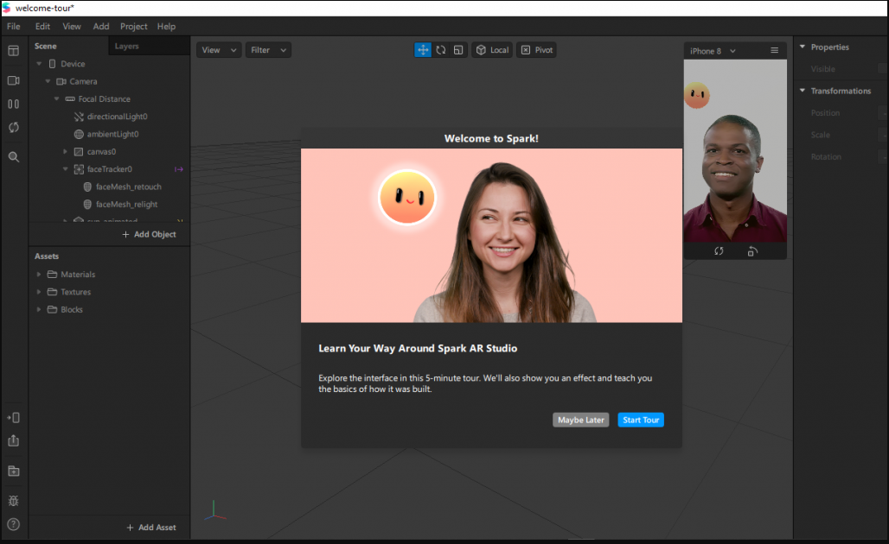

> **Note:** If you still encounter some difficulties installing or launching Spark AR, do not hesitate to contact a friend who knows a minimum in new technologies, no need to contact a computer expert.

### Introducing the Spark AR Studio interface.
The Spark AR home screen shows you examples of already completed basic projects that are also tutorials. On the  left sidebar of your screen, a section titled "Learn" will take you to learning videos. For this tutorial, we will take the option "Create a Project" at the top left of the screen  which allows us to create a new base project, without using a predefined project.

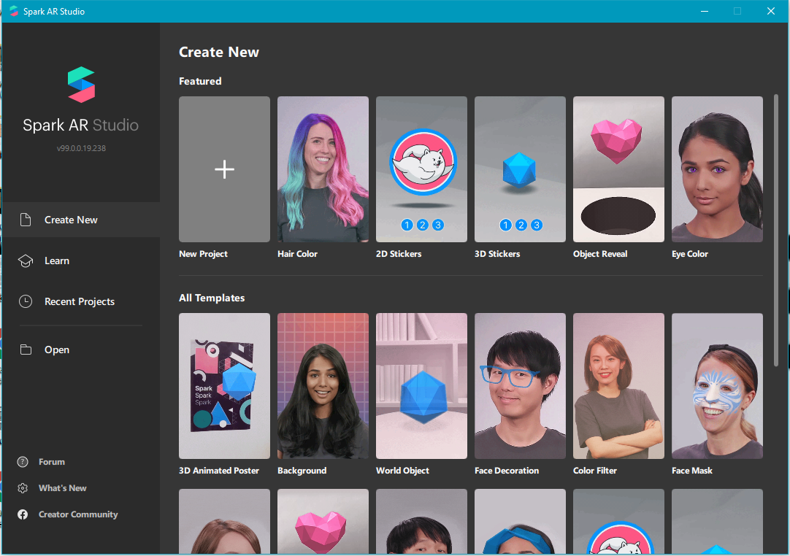

Then click on “**Blank project**” to access the dashboard where we create our filter from zero.

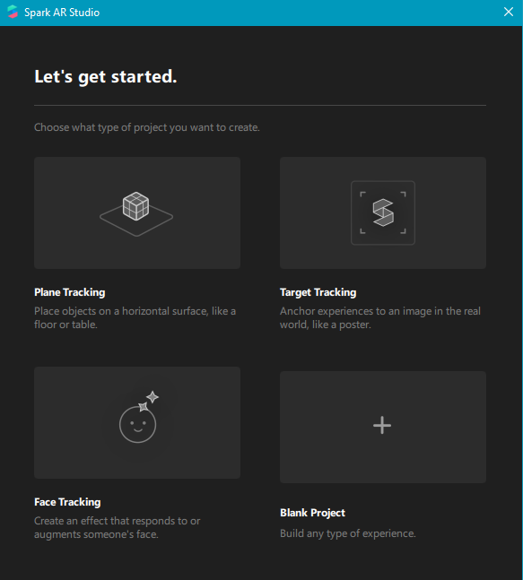

This new interface contains several keys that we will not all be able to present explicitly here. Let's say in general that this filter creation interface is composed of 5 main areas namely:
- **Zone 1**, located on the far left, has several action buttons such as the camera (which will allow you to choose predefined characters to preview your filter or activate your computer webcam to have a live preview), pause / play, refresh, search, test the filter on your smartphone, export, the library of Spark AR Studio, etc.
- **Zone 2** represents the “**Scene**” which contains the various objects which will be used to add functionalities to your filter, such as to follow facial movements, etc. By default you will find a "**Device**" (your smartphone) made up of your camera and your microphone.
- **Zone 3** contains the “**Assets**” like the 3D object, material, texture etc .
- **Zone 4** represents your device with its screen where you have an overview of what is happening on a predefined character model, which you can modify.
- **Zone 5** located on the far right, shows the properties of the objects that you have selected and that you can adjust to your liking. When you click on an object, you have these properties in this area.

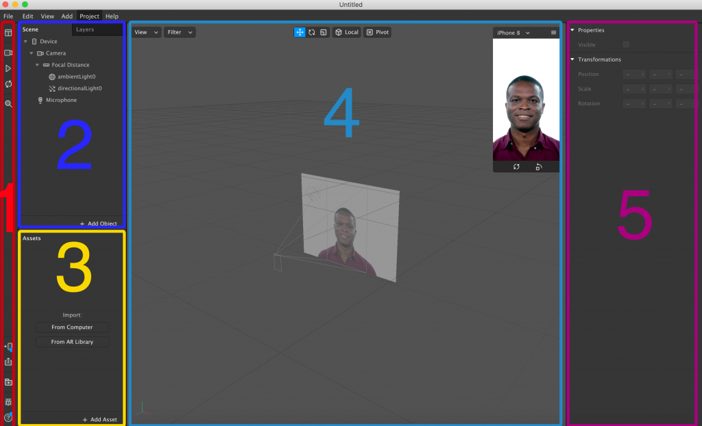

> Now that we are done  with the getting started, we will start creating a  very simple filter for sports fans (FanMask).

## Creating a filter for sports fan (FanMask)
1. **Create a "Facetracker".** The "Facetracker" allows you to find and follow the movements of a face, to create it go to the "Scene" tab, right click on "**Focal Distance**", put your cursor on "**Add**" and in the list that will be offered to you choose "**Face Tracker**", this should create a new entry in your scene as shown below. The "faceTracker" element must be at the same level as the two "ambientLight" and "directionalLight" elements. If not, you've missed something, start over.

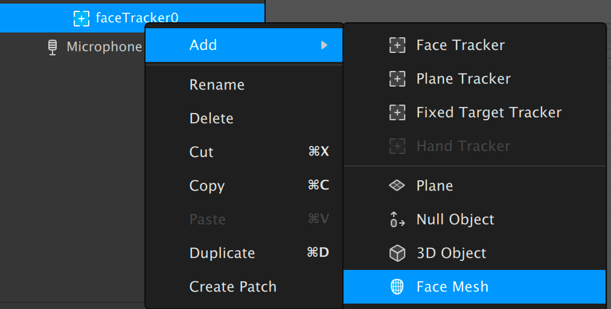

> You can access the camera icon in zone 1 to change the character or use your computer's camera by clicking on the “PC Camera” button.

2. **Add a "Face Mesh"** intended to respond to facial expressions and to place a material. Right click on the object "**Face Mesh**", put your cursor on "**Add**" and click on item "**Face Mesh**" in the list.

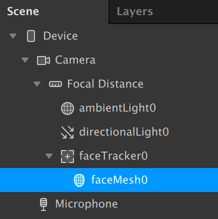

> In "Scene", you now have a "Face Tracker" which has a "Face Mesh".

3. **Add a material in the properties of the “Face Mesh”.** Click on “Face Mesh” to display its properties in the area 5. Click on “ **+** ” at right of “ **Materials** ” located in zone 5.

 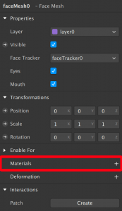

Your material will be listed in area 3 as " **Material0** " which you can rename to help you stay organized as you build your project. For this tutorial we will rename our material0 to “ **facemap** ”. To do this, right click on " **Material0** ", select " **Rename** " and rename the " **Material0** " to " **Facemap** ".

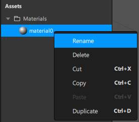

You will get this result in zone 4

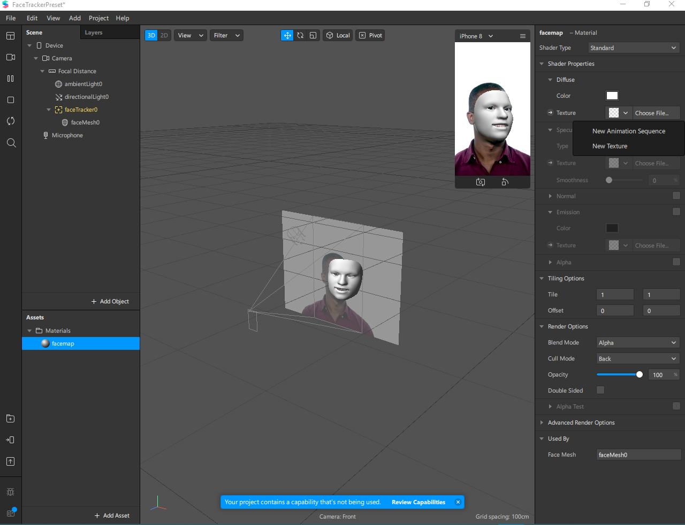

4. **Download your asset** which can be within the framework of this tutorial the flag of a country, a team or a club of football, basketball etc. that you will save on your desktop under the name " **Flag** ". For this tutorial we will be using an image of the flag of Cameroon which you can find at the following address [Cameroonflag](https://www.google.com/search?q=cameroon+flag&client=opera&hs=4Uu&sxsrf=ALeKk02xAh27xfqPHwocL0DNqDtiTsFQw:1603595077924&source=lnms&tbm=isch&sa=X&ved=2ahUKEwjrp6X4c7sAhUjAGMBHZ6hBwsQ_AUoAXoECBMQAw&biw=1560&bih=790#imgrc=IrRjV-_DofwO3M&imgdii=T0-0EblHzjONKM ) . 

5. **Import your asset “Flag” to your assets.**  To do this, click on the “ **Add Asset** ” button in area 3, then click on “ **Import From Computer** ”. In the window that will open, go to your desktop, click on your active image "flag" then on "open". An easy way to import your asset to your assets is to drag and drop your “flag” image asset into the assets board.

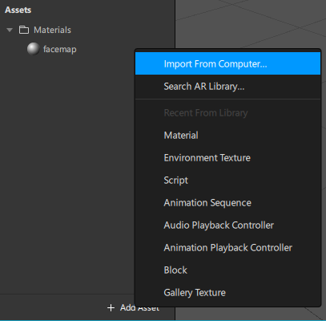

To avoid losing the quality of your image, check the “No Compression” box in area 5.

![alt text] (images/22.PNG)

6. **Add a texture to your “facemap” material.** click on the “ **Facemap** ” material, click on the “ **Texture** ” property in area 5 and choose the “flag” asset in the proposed list.

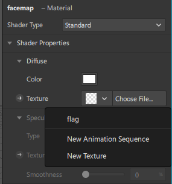

Adjust the Opacity and Brightness at your preference  and clic on Double-sided box to display both sides of a normal face.

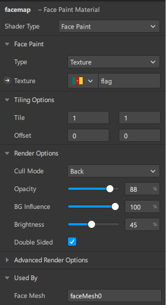

7. **Change the “Shader Type” of your material to “Face Paint”.** In area 5, click on “ **Shader Type** ” and select “ **Face Paint** ” from the list offered.

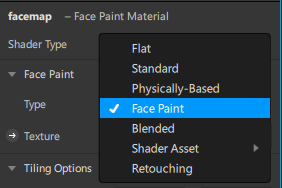

You will get this result in area 4.

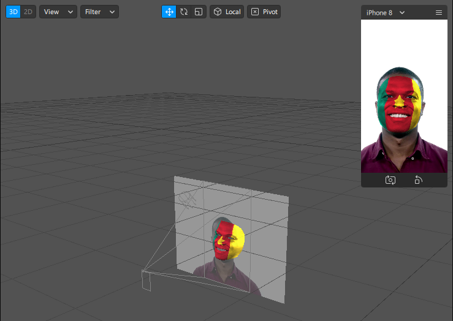

> **Note:** Usually when you use a filter on social networks you have smooth skin. To achieve this, add a new "Face Mesh" according to the method seen in point 3. Put a new material on your new "Face Mesh". Modify the "Shader Type" of your material in "Retouching" and finally smooth the skin of the face by adjusting **Skin Smoothing** up to 100.

8. **Test your filter your filter to see how it shows up on other face types in real time.** On your smartphone, install the Spark AR Player app and then connect your smartphone to your computer using USB cable. In the lower left corner of zone 1, click on the smartphone icon then on " **Send** " in a new window. Your filter will automatically launch on your smartphone. On the other hand, if you have a webcam, click on the camera icon in area 1. You will see a " **PC Camera** " button above the faces for live interactive on your computer, or Change character to display your filter on different face type  and make any additional adjustments you want.

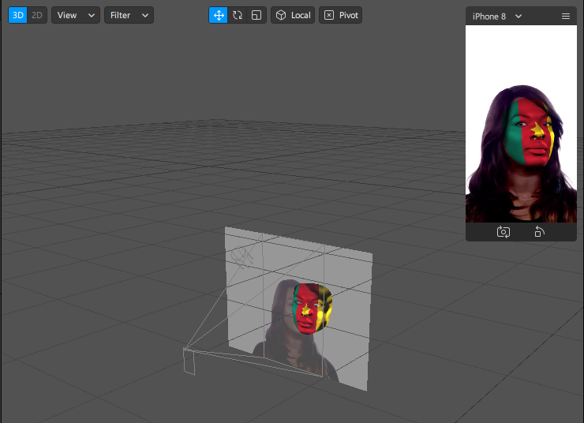

> Now that you have a working filter, let's see how to make it public on social media.

## Post your fanMask filter on Instagram
9. **Save your project to a folder.** To save the project in a local folder, click on " **File** " (on the top left of your screen) and select the option " **Save As** ". A window will open, Choose a save location that you can easily find later and rename your project to  " **FanMask**  " before saving it.

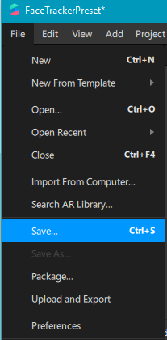

10. **Upload your filter to Sparkhub.** click “ **File**” again and select this time the “ **Upload and Export** ” option.

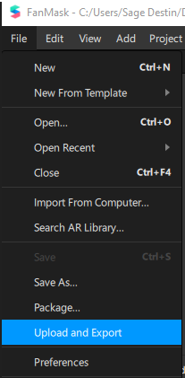

A window will open to indicate the space your filter will use on different types of devices. If everything is green and checked, click on the " **Upload** " button.

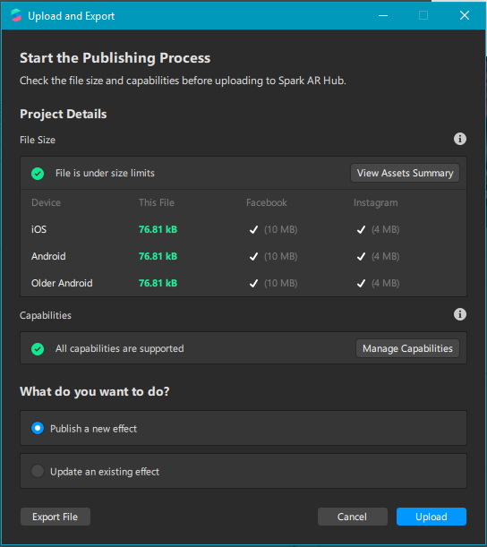

11. **Fill in the requested information.** Once the download is complete, You will automatically be redirected to [Spark AR Hub](https://www.facebook.com/sparkarhub/) to submit your AR filter for approval. This platform also gives the possibility to manage and understand the performance of your AR effects on Facebook and Instagram.

> Make sure you are logged into the Facebook/Instagram account where you want to post the effect.

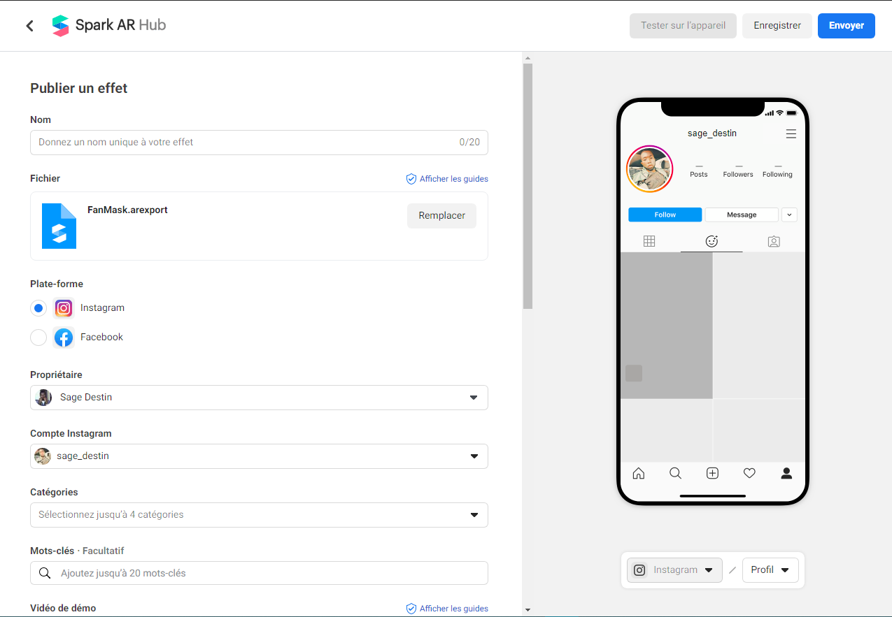

On this Spark AR Hub page, fill in the requested information: Name (FanMaskCmr), Platform (Instagram), Properties (your Instagram account name), Categories (Events etc.). In the " **Effect Icon** " section, drag and drop an image you want to use to represent your Instagram filter. On the " **video Demo** " area, you will have two options: "**Record a video** " and " **Import a file** ". The " **Record Video** " option will give you a link that you can send to your friends, family or colleagues so they can test your Instagram filter.

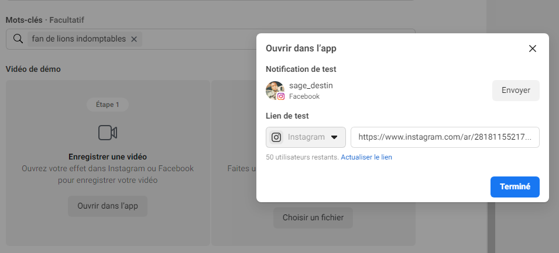

Take a short (2 minutes maximum) video of your filter in action with Instagram or with your smartphone that will show people what your filter does without having to download it. Once you are satisfied with the video, import it in the “ **video Demo** ” area then click “ **Save** ” in the upper right corner of the page.

12. **Verify the information and submit your filter.** If you are ready to publish your filter once you have all submitted and verified the requested information, click the " **Submit** " button in the upper right corner of the page to submit your filter for Facebook review. The process can take days, and if your AR filter meets the different guidelines, it will appear for use.

If you want to test our filter click here [FanMaskCmr](https://www.instagram.com/ar/2818115521758316/?ch=ZmRhZGJlMGYyZWI2NDRlOTc0MzFiZjA2MDkwMWEwMjc%3D).

## Conclusion
Congratulations, You have created your first Instagram filter! We hope this tutorial has given you the basics of creating augmented reality filters and posting them on Instagram.
## What’s next?
If you want to continue working on this project, here are some ideas:
- Add more flags of other countries and sports clubs in this project;
- Create new effects using other features of Spark AR like Creating a glow effect with render passes.
## Find out more about Spark AR.
 Here are some links where you can continue your learning and develop your skills on Spark AR:
- https://sparkar.facebook.com/ar-studio/learn/tutorials/
- https://later.com/blog/spark-ar-instagram/
- https://www.tutorialspoint.com/spark_ar_studio_for_beginners_create_your_own_filters/index.asp
- https://www.youtube.com/watch?v=Dbhy8C3aI_A
- https://www.youtube.com/watch?v=pWj_oiFfNZM

## About the Author
**Sage Destin:** Hello dear reader! I am a biochemistry student at the University of Buea, Cameroon, passionate about technology, beginner on Spark AR and Junior front-end development.
