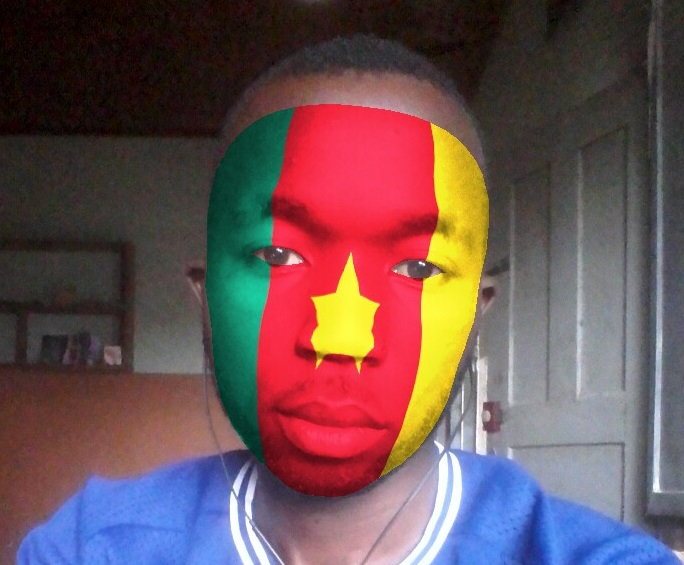
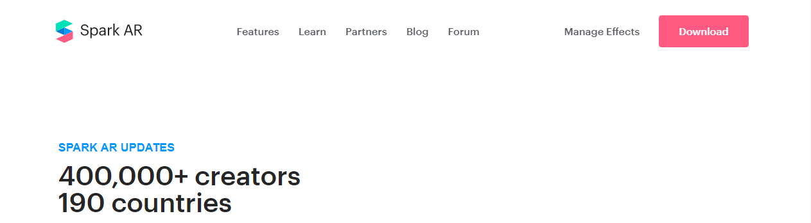
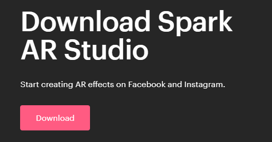
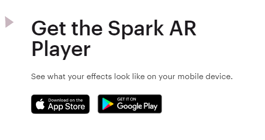
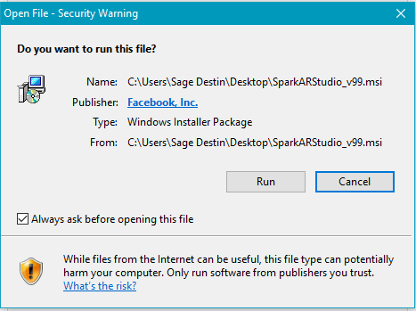
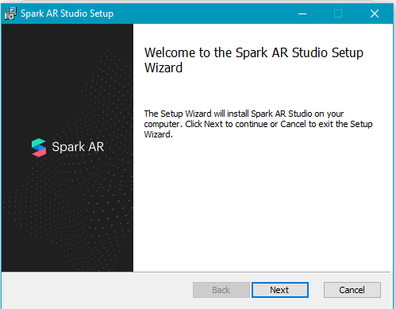
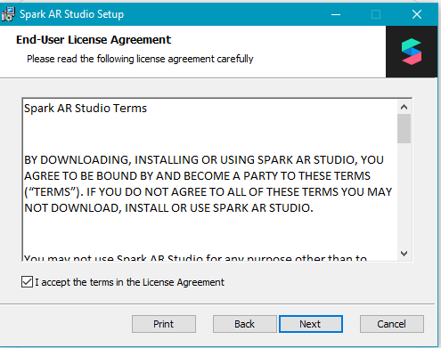
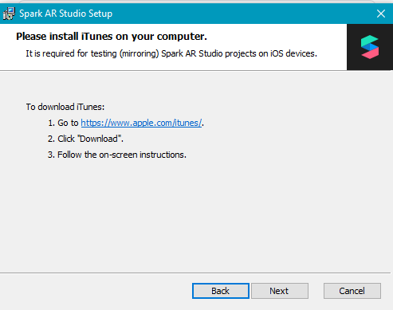
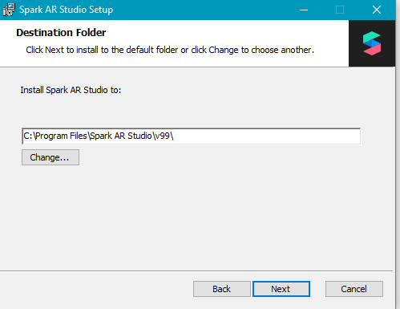
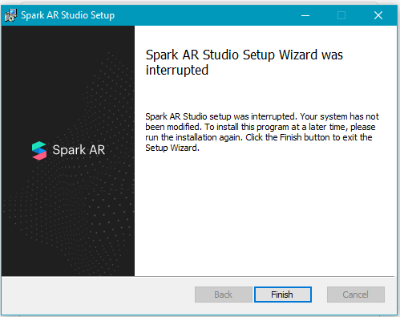

# Learn-the-basics-of-Spark-AR-by-creating-your-FanMask-filter

> Now is the time to learn how to easily create your first augmented reality filter and share it on Instagram with Spark AR the best software for beginners to create awesome filters.

While Instagramming, there's a good chance you've come into contact with an AR filter in some way and have probably had the urge to create your own Instagram filter. So we made this tutorial to teach you how to make Instagram filters. Know that it is very **easy** to create simple filters, to make them accessible to everyone on Instagram and **Anyone can do it** thanks to the software **Spark AR Studio**, which only works on computer.

Through this tutorial, we'll show you how to easily create your first Spark AR augmented reality filter and share it on the Facebook family of apps like Instagram. Using:
- Spark AR Studio
- A smartphone
## Purpose
The purpose of this tutorial is to provide a general overview of Spark AR Studio and its working interface, create a sports fan face mask AR filter, test it and export it to Instagram.
## Prerequisites
- Have access to a machine connected to the internet
- Have access to a smartphone connected to the internet
- Have downloaded and installed **Spark AR studio** on your machine (If you haven't done it yet or don't know how to do it, that's okay because we'll explain how to do it in this tutorial) .
- Have installed the application for iOS and Android **Spark AR Player** on your smartphone.
- Have an Instagram and / or Facebook account in good standing.
## Summary
- Introduction and Getting Started with Spark AR Studio
- Creation of a filter for sports fan (FanMask)
- Publish your fanMask filter on Instagram

## Introduction and Getting Started with Spark AR Studio
**Augmented Reality (AR)** is a technology that allows the superimposition of virtual elements (sounds, 2D, 3D images, videos, etc.) within a real-time environment. The principle is to combine the virtual and the real and give the illusion of perfect integration to the user.

**AR filters** are computer-generated effects designed to be overlaid on real images. AR filters work with your camera, adding a layer or images to the foreground or background of your image. While Instagram AR Filters were first introduced in 2017, it was not possible for anyone to create their own AR filters until recently or Facebook released their AR filter maker app called Spark AR Studio.

**Spark AR Studio** is free software developed by Facebook to help anyone have an augmented reality experience by making AR filters for **Instagram** and **Facebook** for free. AR stands for Augmented Reality. The download site and software (available for Windows and Mac) are in English at the moment, but don't worry, we're here to help. In order to test your AR filters, we recommend that you also download **Spark AR Player**.

**Spark AR Player** is an app for iOS and Android, which lets you see what your AR filters will look like live on a smartphone before posting it publicly on **Instagram** or **Facebook**.

#### Creating your very first Instagram AR filter will mean learning new terminology, here is a step by step guide for you to get started and terminologies used on Spark AR Studio so you can start creating your own filter.

1. **Download the Spark AR Studio software** by going to the official website at the following address: https://sparkar.facebook.com/ar-studio/download/. Click on "**download**" at the top right of the page that will appear on your screen

,

Then click again on the red button "**download**" on the left of your screen.

> You can also go to google, search for Spark AR studio and choose the first result to go to the download site.

2. **Install Spark AR Player** which is available on the Google Play Store for Android devices and on the Apple App Store for iPhones. You will also find this app in the middle of the page https://sparkar.facebook.com/ar-studio/download/. From your smartphone, you will have to click on one of the two download buttons (one for iOS and another for Android) located under "**Get the Spark AR Player**", because from your computer, nothing will happen.

3. **Install the Spark AR.** If you don't know how, follow these instructions, it's a snap (we are using version 99 of 10/20/2020 for Windows in this tutorial) .

- Double click on the downloaded file icon. On the interface presented to you, click on the button "**Run**"

- Then click on the button "**Next**"

- Accept the terms in the license agreement and click on "**Next**"

- In the new window, click again on "**Next**"

 

- Choose the local disk on which you want to install Spark AR, we advise you to leave the default values and simply click on "**Next**"

- Once you get to the penultimate page, all you have to do is click on "**Install**"

![alt text] (images/9.PNG)

Finally click on "**Finish**" to complete the installation.

> Now let's check that the installation was successful by launching the application.

4. **Launch the Spark AR Studio software.** Go to the home page of your Windows PC. Type (**Spark AR**) in the search bar located at the bottom left of your screen and near the white square made up of four other white squares representing your computer menu. You will see the Spark AR icon appear, click on it and wait a few seconds for the application to launch. After logging in with either your Facebook or Instagram account, a window will open at least similar, click on "Maybe Later" (new features are added to the software every two weeks, you might have a few things slightly different if you use another version). We recommend that you come back later and click on the “**Start Tour**” button which will show you already achieved effects and teach you how to build them.

![alt text] (images/11.PNG)

> **Note:** If you still encounter some difficulties installing or launching Spark AR, do not hesitate to contact a friend who knows a minimum in new technologies, no need to contact a computer expert.
